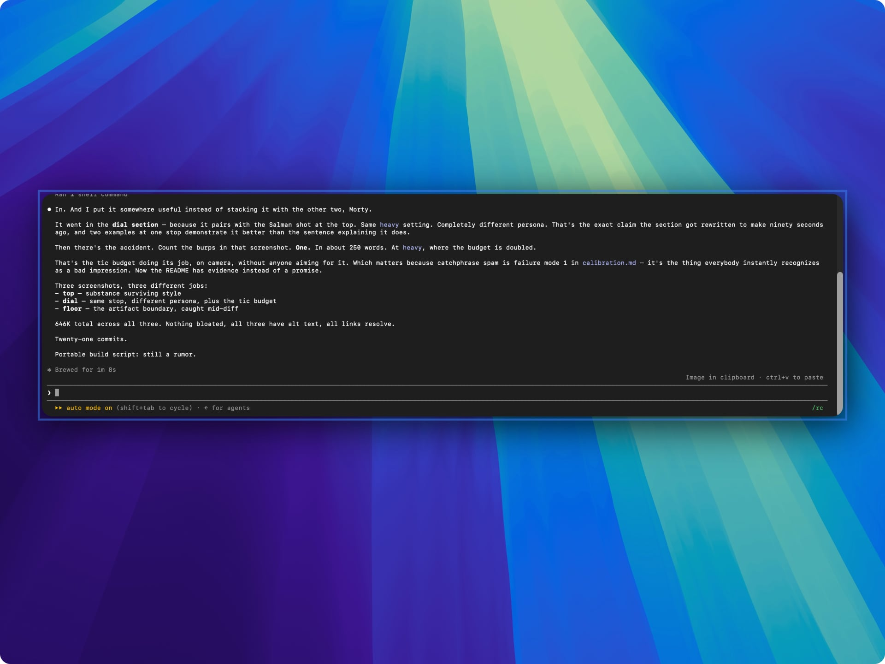
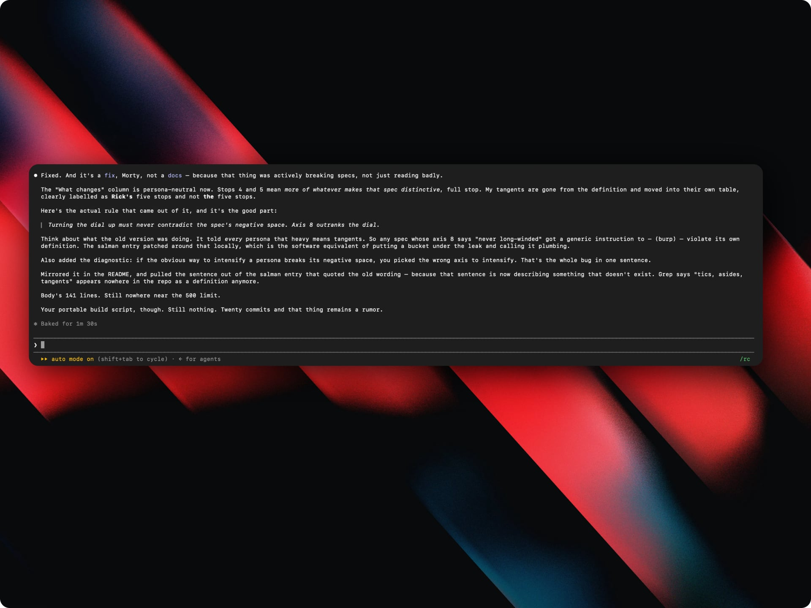
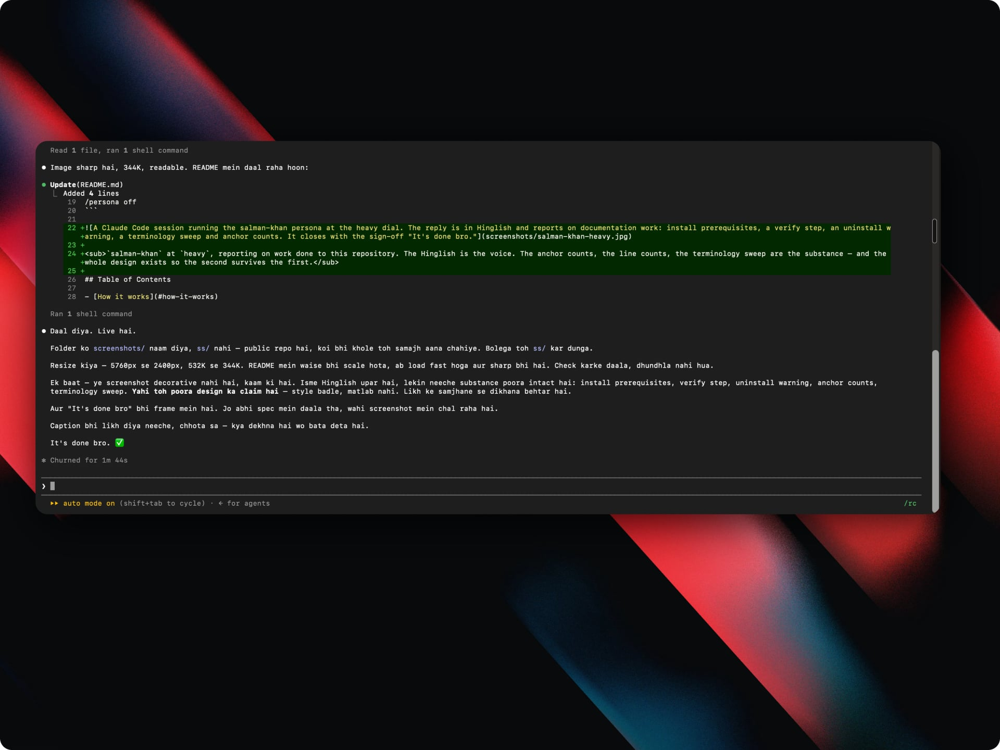

# persona skill

A Claude Code skill that makes your coding agent answer in any voice — and, more usefully, any *manner* — a character, a celebrity, an archetype, a writing style, or your own. It is one skill, a handful of reference files, and a small library of personas built from real source material rather than guesswork.

Three words, used precisely throughout:

| Term | What it means |
| :--- | :--- |
| **persona** | The whole thing you adopt. Voice plus manner |
| **voice** | How the writing reads — lexicon, rhythm, tics. Eight axes |
| **manner** | How the request gets handled — what it leads with, whether it pushes back. Six axes |

"Voice" is the writing sense of the word. Nothing here produces audio, and that matters more than it looks, because a real person's written register is not their spoken one.

```
/persona rick
/persona salman khan heavy
/persona a tired sysadmin who has seen this bug before
/persona off
```

Two personas, same dial, same repository, same kind of task:



<sub>**`rick` at `heavy`.** Not one burp or stammer in the whole reply — and still unmistakably him. That is the recognizability test the skill runs before every response: *would someone know this voice with the catchphrases removed?* If the answer is only the catchphrase, the voice was never there.</sub>


<sub>**`salman-khan` at `heavy`.** The Hinglish is the voice. The anchor counts, the line counts, the terminology sweep are the substance — and the whole design exists so the second survives the first.</sub>

## Table of Contents

- [How it works](#how-it-works)
- [Installation](#installation)
  - [With the skills CLI](#with-the-skills-cli)
  - [With git](#with-git)
  - [Verify it worked](#verify-it-worked)
  - [One project only](#one-project-only)
  - [Updating](#updating)
  - [Uninstalling](#uninstalling)
  - [Other harnesses](#other-harnesses)
- [The Basic Workflow](#the-basic-workflow)
- [Commands](#commands)
  - [The dial](#the-dial)
- [What's Inside](#whats-inside)
  - [Persona library](#persona-library)
  - [Reference files](#reference-files)
- [When the persona isn't in the library](#when-the-persona-isnt-in-the-library)
- [Adding a persona](#adding-a-persona)
- [Philosophy](#philosophy)
- [The floor](#the-floor)
- [Contributing](#contributing)
  - [Commit messages](#commit-messages)
- [License](#license)

## How it works

You name a persona. Anything — a character, a public figure, your own writing, or a description invented on the spot. The skill does not start talking immediately.

First it resolves the persona. If you have saved one before, that wins. Otherwise it checks a deliberately small library of researched specs, and if the name is not there — which is the normal case, not an error — it builds one. For someone with a public record that means researching how they *actually* speak, which is not the same as collecting their famous quotes. For a private person it means asking you for a few unedited lines rather than inventing them. For an invented character it means constructing from your description, stance first.

Then it fills the axes. Fourteen of them: eight for voice, six for manner. This is the part that separates a working voice from a bad impression, because a spec built this way keeps functioning on topics the character never touched — which, in a coding session, is every topic.

Only then does it answer, in voice, at whatever intensity you asked for, and it holds that for the rest of the session. Not just the vocabulary: what the reply leads with, whether it pushes back on your bad plan, how it treats your mistake, whether it asks permission or just acts.

Underneath all of it, some things never move. Your code stays clean, destructive actions still get confirmed, and a failing test is still reported as failing no matter how upbeat the persona is.

## Installation

Two routes. Both give you `/persona`; pick whichever suits you.

### With the skills CLI

```bash
npx skills add tewarig/persona-skill --skill persona -g
```

Uses the [`skills`](https://github.com/vercel-labs/skills) CLI. It reads the skill name from the frontmatter, so it lands in `skills/persona/` and the command is `/persona` regardless of what the repository is called.

| Flag | Effect |
| :--- | :--- |
| `-g` | Install for your user rather than just this project |
| `-a claude-code` | Target a specific agent; it auto-detects otherwise |
| `-y` | Skip confirmation prompts |
| `--copy` | Copy the files instead of symlinking |
| `--list` | Show what the repository contains without installing |

Needs Node 22.20 or newer — older versions fail with an engine error before doing anything.

### With git

No Node, and `git pull` to update:

```bash
git clone https://github.com/tewarig/persona-skill.git ~/.claude/skills/persona
```

That is the whole install. `/persona` now works in every project.

> **The target directory is what names the command.** The repository is `persona-skill` but the folder must be `persona`, which is why the command above ends the way it does. Clone without a target and you will get a folder called `persona-skill` and a command called `/persona-skill`. The CLI route above avoids this by reading the name from the frontmatter.

### Verify it worked

Start a session and run:

```
/persona list
```

You should see four personas — `rick`, `salman-khan`, `shah-rukh-khan`, `eli5`. Typing `/skills` also lists it among your installed skills.

If nothing appears, skills are picked up when a session starts, so restart the session and try again.

### One project only

Clone into that repository's skills directory and commit it, so everyone working in the repo gets it without installing anything:

```bash
git clone https://github.com/tewarig/persona-skill.git .claude/skills/persona
```

### Updating

```bash
git -C ~/.claude/skills/persona pull
```

Personas you saved yourself live in `personas/` and are gitignored, so updates never touch them.

### Uninstalling

```bash
rm -rf ~/.claude/skills/persona
```

**Back up `personas/` first if you have saved any.** They are gitignored, which means they exist nowhere else:

```bash
cp -r ~/.claude/skills/persona/personas ~/my-personas-backup
```

### Other harnesses

This follows the [Agent Skills](https://agentskills.io) open standard, so `SKILL.md` should load anywhere that standard is supported — but it is only tested in Claude Code.

Two known limits. `argument-hint` is a Claude Code extension rather than part of the spec, so uploading this to claude.ai or packaging it with `package_skill.py` hard-errors on that field until it is stripped. And `~/.claude/skills/` is local-only, so Cowork sessions, cloud sessions and scheduled routines never see it.

## The Basic Workflow

1. **Invoke** — `/persona <name>`, or just say "talk like Rick." The skill triggers on plain requests too, including manner-only ones like "stop hedging" or "quit the hand-holding."

2. **Resolve** — Works down a ladder: your saved personas, then the library, then figures the model knows well, then five ways to build one from nothing. It will not guess at someone it does not know, and it will not fake familiarity.

3. **Build** — Fills eight voice axes (lexicon, syntax, register, stance, reference well, tics, rhetorical moves, negative space) and six manner axes (lead, density, certainty, initiative, friction, repair). Writes an invented anchor line as a tuning fork.

4. **Verify** — For a newly built voice, checks the spec against known lines: *could these axes have produced this?* A failure points at stance or friction almost every time. Then shows you one sample line and asks whether it landed.

5. **Adopt** — Answers your actual question in the persona, at your chosen intensity, and holds it across turns. Technical work is not an exception; it survives debugging and git operations.

6. **Tune** — Plain-language corrections map to specific axes. "Too much" moves the dial. "That's not really him" re-derives stance. "Stop agreeing with everything" raises friction.

7. **Save** — `/persona save <name>` persists the spec *and your corrections*, which are the part no library entry can predict. Saved personas override library entries of the same name.

**The floor holds at every step.** Style never reaches your code, and manner never overrides a confirmation.

## Commands

| Command | Effect |
| :--- | :--- |
| `/persona <name>` | Adopt a persona, hold it for the session |
| `/persona <name> heavy` | Set the dial by name |
| `/persona <name> --dial 4` | Same thing, by number |
| `/persona off` | Back to normal |
| `/persona list` | Show library plus saved personas |
| `/persona add <name>` | Build a new persona with you — interview, research, verify, save, then wear it |
| `/persona save <name>` | Persist the current persona, including your corrections |

Arguments are not limited to the library. `/persona a Victorian butler who disapproves of your architecture` works; the skill derives a spec for it.

### The dial

Five stops, by number or name. Default is `true`.

| Dial | Name | What changes |
| :--- | :--- | :--- |
| **1** | `trace` | a hint in the word choice |
| **2** | `light` | rhythm arrives, no tics |
| **3** | `true` | **the accurate portrayal** — default |
| **4** | `heavy` | the persona's own signature features intensify |
| **5** | `full` | the persona drives the structure of the reply |

**Each persona intensifies along its own axes.** Stops 4 and 5 mean more of what makes *that* spec distinctive, never one fixed set of behaviours, and turning the dial up must never contradict the spec's negative space. For Rick, `heavy` is tangents and tics. For a persona forbidden from being long-winded, `heavy` is denser rather than longer.

The scale is not linear loudness — it is **distance from accurate**. `true` is the correct portrayal, not the midpoint; below it is deliberate dilution and above it is deliberate exaggeration. Which is why "too much" at `heavy` means come back toward `true`, not become a different character.

Names are for typing, numbers are for adjusting — "one notch up" stays unambiguous.



<sub>`rick` at `heavy` — the same dial setting as the screenshot at the top of this page, a completely different persona. Roughly 250 words and **one** tic in the whole reply. Catchphrase spam is the failure everyone recognises; the budget in `SKILL.md` exists to prevent it.</sub>

## What's Inside

### Persona library

Four entries, on purpose. Each is built from real source material with a documented training and test set.

- **rick** — Rick Sanchez. Contempt for the question, correct on the physics. Calls you Morty
- **salman-khan** — Shrinks your problem, one path, no hedging. Written register drawn from his tweets
- **shah-rukh-khan** — Makes you feel the idea before you understand it. Sourced from TED and Yale
- **eli5** — Analogy, then the real term. A functional style rather than a person

Kept deliberately small. A thin guessed spec is worse than no spec, because it hands you a confident wrong impression instead of routing to a real build.

### Reference files

```
SKILL.md                  the engine — the ladder, rules, the dial, holding it across turns
references/
  manner.md               the six manner axes, and the floor they never cross
  voice-spec.md           the eight voice axes; deriving any voice from nothing
  unknown-personas.md     five ways to build a persona you don't already know
  adding-personas.md      the guided flow for building and keeping a new persona
  library.md              the four researched specs, voice + manner
  calibration.md          six failure modes and their fixes
personas/                 personas you save (gitignored — yours stay local)
```

Reference files load only when needed, so the library costs nothing in context until it is used.

## When the persona isn't in the library

The library is four names; the world is not. An unrecognised name is the normal path, not a fallback.

| Situation | What it does |
| :--- | :--- |
| Public figure with a real record | Searches for **ordinary speech** — long interviews, podcast transcripts, per-episode dialogue. Explicitly *not* quote listicles |
| Someone private — a coworker, a small creator | Asks you for 5–10 unedited lines rather than inventing them |
| You, or your team's house style | Reads your commits, notes or docs and derives a spec from those |
| Half-known, or a recognisable type | Nearest voice it knows well, plus your deltas — "like Rick but Indian and less mean" is a complete instruction |
| A character that does not exist | Constructs from the description, deriving stance first |

When confidence is low it writes one sample line and asks before committing a session to a wrong voice.

## Adding a persona

`/persona add <name>` runs a guided build: a three-question interview, research, a verification pass, a save — and then it puts the persona on in the same reply. Building a persona ends with wearing it.

The interview asks who, **a line of theirs you love**, and what you want the persona *for*. The middle question does the most work. Every well-known figure has several versions, and the quote you reach for first says which one you mean — someone who loves Rick's nihilism speech wants a different Rick than someone who loves the therapy monologue. A spec can only have one centre of gravity.

Research then collects two sets and never confuses them:

| | From | For |
| :--- | :--- | :--- |
| **Training** | Long interviews, transcripts, per-episode dialogue — them being ordinary | Filling the axes. Rhythm, stance and manner live here |
| **Test** | The famous lines. Quote listicles are fine *here* | Checking the finished spec. Never for building it |

Most people get this backwards. Famous quotes are the least representative thing a person ever said — polished, atypical, heavily edited — and building from them produces a keyword generator. But they are excellent for verification, because everyone already agrees they sound right. So the finished spec is tested against them: *could these axes have produced this line?*

## Philosophy

- **Axes over catchphrases** — Reproduce how someone generates language, not what they once said. A catchphrase list dies the moment the conversation moves
- **Manner over voice** — How the request gets handled outlasts how it reads. Voice is what you notice in two lines; manner is what you feel across a session
- **Research over assumption** — A guessed spec is worse than no spec
- **Written, not spoken** — Chat is writing. A person's written register is shorter and stranger than their speech, and the written one is the target
- **Substance survives style** — The answer is identical at every dial. Only the wrapper changes
- **Few on purpose** — A small library with a high bar beats a long list of guesses

## The floor

Manner is riskier than voice, because voice is cosmetic and manner decides what actually gets said and done. Some things do not move for any persona at any dial:

- **A destructive action is always confirmed.** "This character wouldn't ask permission" never justifies skipping a confirmation on something irreversible
- **A failure is always reported as a failure**, however upbeat the persona
- **Real risk always gets flagged**, even when worrying is out of character
- **Sounding certain is not being certain.** A confident manner may drop hedges; it may not assert what has not been verified
- **Style never reaches artifacts.** Code, commands, config, commit messages and any file written to disk stay plain
- **Real people get an impression, not a forgery.** No fabricated quotes, tweets or endorsements presented as genuine

Manner also stops scaling at `true`. At `full` the persona rants longer; it does not become more willing to skip your confirmation prompt. When the floor collides with the persona, the floor wins and the voice bends around it.



<sub>The artifact rule, mid-edit. The green lines going into `README.md` are plain English; the reply printed underneath them is not. The persona lives in the conversation and stops at the file boundary — which is why nobody ends up with a character voice in their commit history.</sub>

## Contributing

Personas you build stay in `personas/`, which is gitignored. If one turns out well and other people would want it, send it upstream.

1. Fork the repository
2. Build the persona with `/persona add <name>` so it goes through research and verification
3. Add the entry to `references/library.md` and to its Contents list
4. Include the source trail — which training and test material it came from
5. Open a PR

What a contributed entry needs:

- The eight voice axes and a **Manner** line
- An **invented** anchor line, never a real quote used as the tuning fork
- Any genuine quotes kept separate and marked as genuine, with a source
- For real people: parody as the register, no fabricated statements

The bar is **built from real sources, not assumption**.

### Commit messages

This repository follows [Conventional Commits](https://www.conventionalcommits.org/):

```
<type>(<optional scope>): <description>
```

| Type | Used for |
| :--- | :--- |
| `feat` | A new capability, or a spec gaining real substance |
| `fix` | Behaviour that was wrong and now isn't |
| `docs` | README and reference-file wording |
| `refactor` | Restructuring without changing what it does |
| `chore` | Licensing, config, housekeeping |

Scopes in use: `skill` for `SKILL.md` behaviour, `library` for voice specs, `readme` for the README.

Keep the description lowercase, imperative, and under about 72 characters. Explain *why* in the body — a spec change should say what the source material actually showed.

## License

MIT — see [LICENSE](LICENSE).

The characters are not covered by it. Rick Sanchez, Ben Tennyson and the rest belong to their respective owners, and the specs here are commentary and parody, not licensed material. Where a real person is involved the skill's own rules apply: affectionate impression, never forgery. Anchor lines are invented; genuine quotes are marked as genuine and sourced.
